# AI Video Chaptering - Complete DigitalOcean Architecture

## 🏗️ Architecture Overview

This document describes the complete DigitalOcean deployment architecture for the AI Video Chaptering application, including all components, services, and infrastructure.

## 🌐 Complete DigitalOcean Deployment Architecture

```mermaid
graph TB
    subgraph "User Layer"
        Users[👥 Users]
        CDN[🌍 DigitalOcean CDN]
    end

    subgraph "DigitalOcean App Platform"
        subgraph "Frontend Service"
            Frontend[🖥️ Next.js Static Site]
            FrontendLB[⚖️ Frontend Load Balancer]
        end
        
        subgraph "Backend Services"
            BackendLB[⚖️ Backend Load Balancer]
            API1[🔧 Flask API Instance 1]
            API2[🔧 Flask API Instance 2]
            Worker1[⚙️ Celery Worker 1]
            Worker2[⚙️ Celery Worker 2]
            Monitor[🌸 Flower Monitor]
        end
    end

    subgraph "DigitalOcean Managed Databases"
        PostgreSQL[🗄️ PostgreSQL Cluster]
        Redis[📮 Redis Cluster]
    end

    subgraph "DigitalOcean Spaces"
        Spaces[🪣 Object Storage]
        SpacesCDN[🌍 Spaces CDN]
    end

    subgraph "AI Processing"
        Models[🤖 AI Models Cache]
        STT[🎤 Speech-to-Text]
        LLM[🧠 Language Model]
    end

    Users --> CDN
    CDN --> FrontendLB
    FrontendLB --> Frontend
    
    Frontend --> BackendLB
    BackendLB --> API1
    BackendLB --> API2
    
    API1 --> PostgreSQL
    API2 --> PostgreSQL
    API1 --> Redis
    API2 --> Redis
    API1 --> Spaces
    API2 --> Spaces
    
    Redis --> Worker1
    Redis --> Worker2
    Worker1 --> Models
    Worker2 --> Models
    Worker1 --> STT
    Worker2 --> STT
    Worker1 --> LLM
    Worker2 --> LLM
    
    Monitor --> Redis
    
    Spaces --> SpacesCDN
    SpacesCDN --> Users
```



## 📊 Component Architecture

### Frontend Layer (Next.js)
```yaml
Service: Static Site on DigitalOcean App Platform
Technology: Next.js 13.4.3 with TypeScript
Deployment: Static export optimized for CDN
Features:
  - Server-Side Rendering (SSR)
  - Static Site Generation (SSG)
  - Optimized bundle with code splitting
  - Progressive Web App (PWA) ready
  - Built-in performance optimization
```

### Backend Layer (Flask)
```yaml
Service: Container-based app on DigitalOcean App Platform
Technology: Flask 3.0.3 with Python 3.11
Deployment: Docker containers with auto-scaling
Features:
  - RESTful API endpoints
  - WebSocket support (Socket.IO)
  - Background job processing
  - Real-time progress tracking
  - Comprehensive error handling
```

### AI Processing Layer (Celery)
```yaml
Service: Background workers on DigitalOcean App Platform
Technology: Celery with Redis broker
Deployment: Dedicated worker containers
Features:
  - Scalable job processing
  - AI model management
  - Speech-to-text processing
  - Language model inference
  - Progress tracking and notifications
```

### Database Layer
```yaml
PostgreSQL Cluster:
  - Version: 15
  - Configuration: Managed database
  - Features: Automatic backups, read replicas, monitoring
  - Scaling: Vertical scaling available

Redis Cluster:
  - Version: 7
  - Purpose: Job queue, caching, session storage
  - Features: Automatic failover, monitoring
  - Scaling: Horizontal scaling available
```

### Storage Layer
```yaml
DigitalOcean Spaces:
  - S3-compatible object storage
  - CDN integration for global delivery
  - Automatic backups and versioning
  - Direct upload support
  - Secure access with IAM
```

## 🔄 Data Flow Architecture

### Video Processing Workflow


### Real-time Communication

```mermaid
graph LR
    Frontend[🖥️ Frontend] <-->|WebSocket| API[🔧 Backend API]
    API <-->|Redis PubSub| Worker[⚙️ Celery Worker]
    Worker -->|Progress Updates| API
    API -->|Live Updates| Frontend
```


## 🏭 Production Infrastructure

### Auto-Scaling Configuration
```yaml
Frontend:
  Instance Type: Static site (CDN-cached)
  Scaling: Automatic via CDN
  Performance: Global edge caching

Backend API:
  Instance Type: basic-xs to basic-s
  Auto-scaling: 1-5 instances
  Load Balancer: Built-in App Platform LB
  Health Checks: /api/health endpoint

Celery Workers:
  Instance Type: basic-s to basic-m
  Auto-scaling: 1-10 workers
  Queue Monitoring: Redis queue depth
  Resource Monitoring: CPU and memory usage
```

### High Availability Setup
```yaml
Database:
  Primary: PostgreSQL cluster with automatic failover
  Backup: Automatic daily backups with point-in-time recovery
  Monitoring: Built-in metrics and alerting

Redis:
  Configuration: Managed cluster with replication
  Persistence: RDB + AOF for durability
  Monitoring: Memory usage and connection tracking

Storage:
  Redundancy: Multi-zone replication
  Backup: Automatic versioning and lifecycle policies
  CDN: Global edge cache for fast access
```

## 🔧 Development vs Production

### Local Development Architecture

```mermaid
graph TB
    subgraph "Docker Compose Local"
        LocalFrontend[🖥️ Next.js Dev Server]
        LocalAPI[🔧 Flask Dev Server]
        LocalWorker[⚙️ Celery Worker]
        LocalNginx[⚖️ Nginx Proxy]
        LocalPostgres[🗄️ PostgreSQL Container]
        LocalRedis[📮 Redis Container]
        LocalMinio[🪣 MinIO S3-Compatible]
        LocalFlower[🌸 Flower Monitor]
    end

    LocalNginx --> LocalFrontend
    LocalNginx --> LocalAPI
    LocalAPI --> LocalPostgres
    LocalAPI --> LocalRedis
    LocalAPI --> LocalMinio
    LocalRedis --> LocalWorker
    LocalWorker --> LocalMinio
    LocalFlower --> LocalRedis
```


### Environment Parity
| Component | Development | Production |
|-----------|-------------|------------|
| Frontend | Next.js dev server | Static site on App Platform |
| Backend | Flask dev server | Gunicorn on App Platform |
| Database | PostgreSQL container | Managed PostgreSQL cluster |
| Queue | Redis container | Managed Redis cluster |
| Storage | MinIO container | DigitalOcean Spaces |
| Load Balancer | Nginx container | App Platform load balancer |
| SSL/TLS | Self-signed | Automatic Let's Encrypt |
| Monitoring | Flower container | Flower + App Platform metrics |

## 📈 Performance Optimization

### Frontend Optimizations
```yaml
Static Generation:
  - Pre-built pages for faster loading
  - Optimized images with Next.js Image component
  - Code splitting for reduced bundle size
  - Service worker for offline capability

CDN Configuration:
  - Global edge caching
  - Brotli compression
  - HTTP/2 support
  - Optimized cache headers
```

### Backend Optimizations
```yaml
Application:
  - Gunicorn with eventlet workers for WebSocket
  - Connection pooling for database
  - Redis caching for frequent queries
  - Async job processing with Celery

Infrastructure:
  - Load balancer health checks
  - Auto-scaling based on metrics
  - Resource limits and quotas
  - Horizontal pod autoscaling
```

### AI Processing Optimizations
```yaml
Model Management:
  - Lazy loading of AI models
  - Model caching to reduce cold starts
  - Memory optimization with 4-bit quantization
  - GPU acceleration when available

Job Processing:
  - Queue prioritization
  - Worker auto-scaling based on queue depth
  - Task batching for efficiency
  - Progress tracking and cancellation
```

## 🔒 Security Architecture

### Network Security
```yaml
Traffic Flow:
  - HTTPS/TLS 1.3 encryption
  - CORS configuration
  - Rate limiting per endpoint
  - DDoS protection via App Platform

API Security:
  - Input validation and sanitization
  - SQL injection prevention
  - XSS protection headers
  - CSRF protection
```

### Data Security
```yaml
Database:
  - Encrypted at rest and in transit
  - Access control with least privilege
  - Regular security updates
  - Audit logging

Storage:
  - Encrypted object storage
  - IAM-based access control
  - Secure upload with signed URLs
  - Automatic virus scanning
```

### Application Security
```yaml
Backend:
  - Environment variable secrets
  - JWT token authentication (when implemented)
  - Input validation on all endpoints
  - Secure session management

Frontend:
  - Content Security Policy (CSP)
  - Secure cookie configuration
  - XSS protection
  - Dependency vulnerability scanning
```

## 💰 Cost Optimization

### Resource Allocation
```yaml
Development: ~$50/month
  - Basic instances for all services
  - Minimal storage and bandwidth
  - Single availability zone

Production: ~$130/month
  - Optimized instance sizes
  - Auto-scaling enabled
  - Multi-zone deployment
  - Enhanced monitoring

Enterprise: ~$270/month
  - High-performance instances
  - Advanced security features
  - Premium support
  - Global CDN optimization
```

### Scaling Economics
```yaml
Traffic-Based Scaling:
  - Frontend: CDN scales automatically (no additional cost)
  - Backend: Auto-scale from 1-5 instances
  - Workers: Scale 1-10 based on queue depth
  - Database: Vertical scaling as needed

Storage Costs:
  - Spaces: $0.02/GB/month
  - Database: Included in cluster pricing
  - CDN: $0.01/GB for data transfer
  - Backup: Automatic, included in service
```

## 🔄 Deployment Pipeline

### CI/CD Architecture

```mermaid
graph LR
    Code[📝 Code Changes] --> GitHub[🔄 GitHub Repository]
    GitHub --> Trigger[⚡ Auto Deploy Trigger]
    Trigger --> Build[🔨 App Platform Build]
    Build --> Test[🧪 Automated Tests]
    Test --> Deploy[🚀 Rolling Deployment]
    Deploy --> Health[🏥 Health Checks]
    Health --> Live[✅ Live Application]
```


### Deployment Strategies
```yaml
Blue-Green Deployment:
  - Zero-downtime deployments
  - Automatic rollback on failure
  - Health check validation
  - Database migration handling

Rolling Updates:
  - Gradual instance replacement
  - Load balancer integration
  - Service mesh coordination
  - Progressive traffic shifting
```

This architecture provides a robust, scalable, and cost-effective solution for deploying the AI Video Chaptering application entirely on DigitalOcean's platform while maintaining development-production parity through Docker containers. 