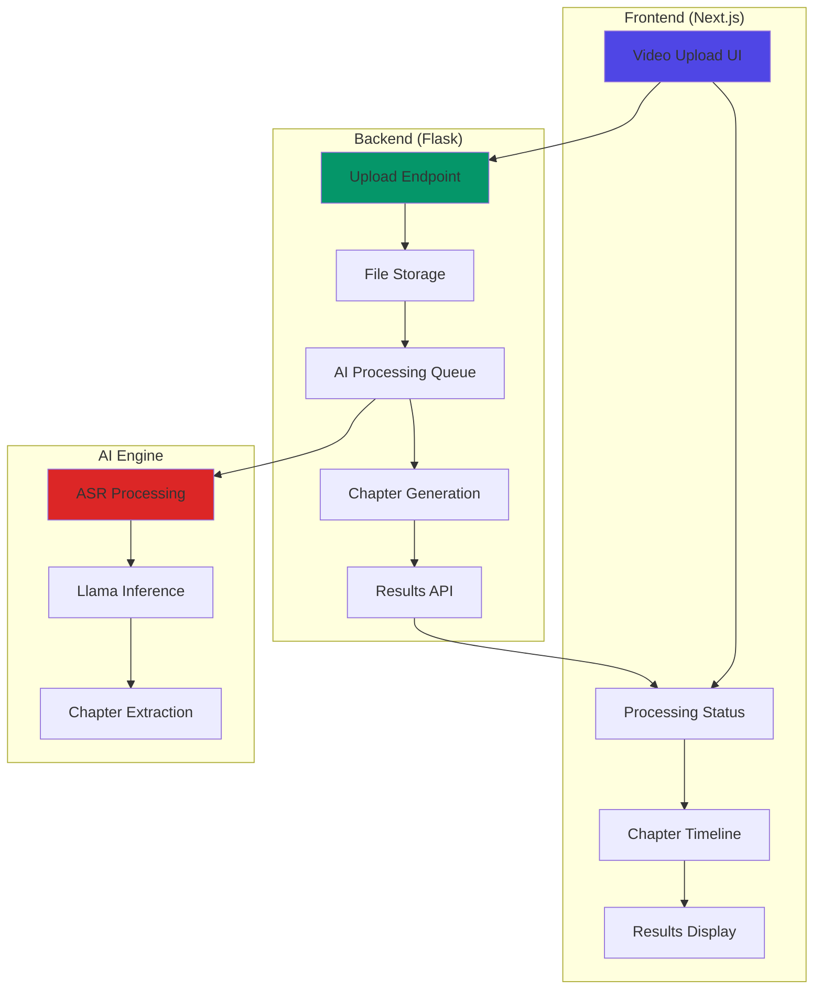
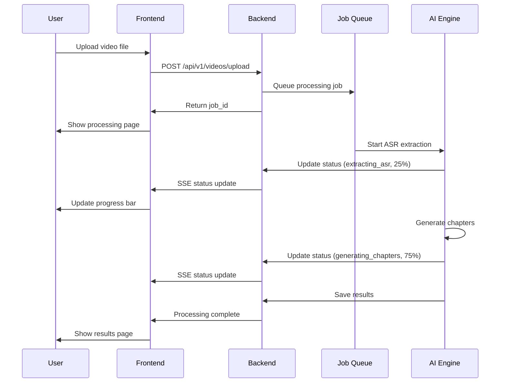

# CREATIVE DESIGN: VIDEO CHAPTERING WEB APPLICATION

> **Comprehensive design document for integrating Chapter-Llama AI functionality into a modern web application**

## 🎯 PROJECT VISION

### **Application Purpose**
Transform the Chapter-Llama research project into a production-ready web application that enables users to automatically generate chapters for long-form videos using AI.

### **Value Proposition**
- **For Content Creators:** Automatically segment hour-long videos into meaningful chapters
- **For Viewers:** Enhanced navigation and content discovery in long videos
- **For Educators:** Structured learning materials with clear section breaks
- **For Businesses:** Professional video organization and accessibility

## 🏗️ ARCHITECTURE DESIGN

### **System Architecture**


### **Technology Integration**
**Frontend Stack (Preserved):**
- Next.js 13.4.3 with App Router
- React 18.2.0 with TypeScript 5.0.4
- Tailwind CSS 3.3.2 for responsive design
- Vercel deployment compatibility

**Backend Integration (Enhanced):**
- Flask 3.0.3 as base web server
- New AI processing endpoints
- File upload and storage management
- Async job queue integration

**AI Components (New):**
- Llama-3.1-8B-Instruct model
- faster-whisper for ASR
- Custom chapter generation pipeline
- GPU/CPU inference optimization

## 🎨 USER INTERFACE DESIGN

### **Page Structure**
```
/app/
├── page.tsx                    # Home/Upload page
├── process/
│   └── [id]/
│       └── page.tsx           # Processing status page
├── results/
│   └── [id]/
│       └── page.tsx           # Chapter results page
├── components/
│   ├── upload/
│   │   ├── VideoUpload.tsx    # Drag & drop upload
│   │   ├── FilePreview.tsx    # Upload preview
│   │   └── UploadProgress.tsx # Upload progress bar
│   ├── processing/
│   │   ├── StatusIndicator.tsx # Processing status
│   │   ├── ProgressBar.tsx     # AI processing progress
│   │   └── EstimatedTime.tsx   # Time estimates
│   └── results/
│       ├── ChapterTimeline.tsx # Interactive timeline
│       ├── ChapterList.tsx     # Chapter navigation
│       └── VideoPlayer.tsx     # Video with chapters
```

### **Key UI Components**

#### 1. **Video Upload Interface**
```typescript
interface VideoUploadProps {
  onUpload: (file: File) => void;
  maxSize: number; // 1GB limit
  acceptedFormats: string[]; // mp4, mov, avi, etc.
}

// Features:
// - Drag & drop area with visual feedback
// - File format validation
// - Size limit checking  
// - Upload progress indicator
// - Video preview thumbnail
```

#### 2. **Processing Status Dashboard**
```typescript
interface ProcessingStatusProps {
  jobId: string;
  currentStage: 'uploading' | 'extracting_asr' | 'generating_chapters' | 'complete';
  progress: number; // 0-100
  estimatedTime: number; // seconds remaining
  videoInfo: {
    filename: string;
    duration: number;
    size: number;
  };
}

// Features:
// - Real-time progress updates via WebSocket/SSE
// - Stage-by-stage breakdown
// - Time estimates based on video length
// - Cancel processing option
// - Error handling and recovery
```

#### 3. **Chapter Timeline Viewer**
```typescript
interface ChapterTimelineProps {
  chapters: Chapter[];
  videoDuration: number;
  onChapterClick: (timestamp: number) => void;
  videoRef: RefObject<HTMLVideoElement>;
}

interface Chapter {
  timestamp: string; // "HH:MM:SS"
  title: string;
  startTime: number; // seconds
  endTime?: number; // seconds
}

// Features:
// - Interactive timeline with chapter markers
// - Hover previews for chapter content
// - Click-to-seek video navigation
// - Chapter title editing capability
// - Export options (JSON, SRT, VTT)
```

### **Responsive Design Patterns**

#### **Mobile-First Approach**
```css
/* Mobile (default) */
.upload-area {
  @apply p-4 min-h-48 border-2 border-dashed border-gray-300;
}

/* Tablet */
@media (min-width: 768px) {
  .upload-area {
    @apply p-8 min-h-64;
  }
}

/* Desktop */
@media (min-width: 1024px) {
  .upload-area {
    @apply p-12 min-h-80;
  }
}
```

#### **Dark Mode Support**
```css
.timeline-container {
  @apply bg-white dark:bg-gray-800 
         border-gray-200 dark:border-gray-700
         text-gray-900 dark:text-white;
}

.chapter-marker {
  @apply bg-blue-500 dark:bg-blue-400 
         hover:bg-blue-600 dark:hover:bg-blue-300;
}
```

## 🔧 BACKEND API DESIGN

### **Flask Endpoint Structure**
```python
# api/routes/video_processing.py
from flask import Blueprint, request, jsonify
from werkzeug.utils import secure_filename

video_bp = Blueprint('video', __name__)

@video_bp.route('/api/v1/videos/upload', methods=['POST'])
def upload_video():
    """
    Upload video file and initiate processing
    Returns: job_id for tracking progress
    """
    pass

@video_bp.route('/api/v1/videos/<job_id>/status', methods=['GET'])
def get_processing_status(job_id):
    """
    Get current processing status and progress
    Returns: current stage, progress %, estimated time
    """
    pass

@video_bp.route('/api/v1/videos/<job_id>/chapters', methods=['GET'])
def get_chapters(job_id):
    """
    Retrieve generated chapters for processed video
    Returns: chapters with timestamps and titles
    """
    pass

@video_bp.route('/api/v1/videos/<job_id>/download', methods=['GET'])
def download_chapters(job_id):
    """
    Download chapters in various formats (JSON, SRT, VTT)
    """
    pass
```

### **AI Processing Pipeline**
```python
# api/services/chapter_service.py
class ChapterGenerationService:
    def __init__(self):
        self.model = None  # Llama model instance
        self.tokenizer = None
        self.asr_processor = None  # faster-whisper
    
    async def process_video(self, video_path: str, job_id: str):
        """
        Complete video processing pipeline
        1. Extract ASR transcript
        2. Generate chapters using Llama
        3. Post-process and validate results
        """
        try:
            # Update job status: 'extracting_asr'
            await self.update_job_status(job_id, 'extracting_asr', 10)
            
            # Extract audio and generate transcript
            transcript, duration = await self.extract_asr(video_path)
            await self.update_job_status(job_id, 'extracting_asr', 50)
            
            # Generate chapters using AI
            await self.update_job_status(job_id, 'generating_chapters', 60)
            chapters = await self.generate_chapters(transcript, duration)
            await self.update_job_status(job_id, 'generating_chapters', 90)
            
            # Save results and mark complete
            await self.save_results(job_id, chapters)
            await self.update_job_status(job_id, 'complete', 100)
            
        except Exception as e:
            await self.handle_error(job_id, str(e))
```

### **Job Queue Integration**
```python
# api/services/job_queue.py
from celery import Celery

celery_app = Celery('chapter_processing')

@celery_app.task(bind=True)
def process_video_task(self, job_id, video_path):
    """
    Async task for video processing
    Enables background processing without blocking web requests
    """
    service = ChapterGenerationService()
    return service.process_video(video_path, job_id)
```

## 📊 DATA FLOW DESIGN

### **Processing Workflow**


### **File Storage Strategy**
```
uploads/
├── videos/
│   ├── {job_id}/
│   │   ├── original.mp4      # Uploaded video
│   │   ├── metadata.json     # Video info
│   │   └── thumbnail.jpg     # Preview image
├── transcripts/
│   └── {job_id}/
│       ├── asr.txt          # Raw transcript
│       └── processed.json    # Structured transcript
└── results/
    └── {job_id}/
        ├── chapters.json     # Generated chapters
        ├── chapters.srt      # SRT format
        └── chapters.vtt      # WebVTT format
```

## 🚀 DEPLOYMENT ARCHITECTURE

### **Vercel Frontend Deployment**
```yaml
# vercel.json
{
  "framework": "nextjs",
  "buildCommand": "npm run build",
  "devCommand": "npm run dev",
  "installCommand": "npm install",
  "functions": {
    "app/api/upload/route.ts": {
      "maxDuration": 300
    }
  },
  "env": {
    "FLASK_API_URL": "https://your-flask-api.herokuapp.com"
  }
}
```

### **Flask Backend Deployment Options**

#### **Option 1: Heroku (Recommended for MVP)**
```dockerfile
# Dockerfile
FROM python:3.12-slim

WORKDIR /app
COPY requirements.txt .
RUN pip install -r requirements.txt

COPY . .
EXPOSE 5000

CMD ["gunicorn", "--bind", "0.0.0.0:5000", "api.index:app"]
```

#### **Option 2: Railway/Render (Alternative)**
```yaml
# railway.json
{
  "build": {
    "builder": "DOCKERFILE"
  },
  "deploy": {
    "startCommand": "gunicorn --bind 0.0.0.0:$PORT api.index:app",
    "healthcheckPath": "/api/health"
  }
}
```

### **Environment Configuration**
```python
# api/config.py
import os

class Config:
    # Model settings
    LLAMA_MODEL_PATH = os.getenv('LLAMA_MODEL_PATH', 'meta-llama/Llama-3.1-8B-Instruct')
    MODEL_CACHE_DIR = os.getenv('MODEL_CACHE_DIR', './models')
    
    # File upload settings
    MAX_FILE_SIZE = int(os.getenv('MAX_FILE_SIZE', 1024 * 1024 * 1024))  # 1GB
    UPLOAD_FOLDER = os.getenv('UPLOAD_FOLDER', './uploads')
    
    # Processing settings
    USE_GPU = os.getenv('USE_GPU', 'false').lower() == 'true'
    MAX_CONCURRENT_JOBS = int(os.getenv('MAX_CONCURRENT_JOBS', 2))
    
    # Redis for job queue
    REDIS_URL = os.getenv('REDIS_URL', 'redis://localhost:6379')
```

## 🎯 PROGRESSIVE ENHANCEMENT STRATEGY

### **Phase 1: MVP (Minimum Viable Product)**
**Timeline:** 2-3 weeks
- Basic video upload functionality
- ASR-only chapter generation (simpler, faster)
- Simple timeline display
- Essential error handling

**Features:**
- Single video upload with format validation
- Background ASR processing
- Basic chapter generation using transcript only
- Simple list view of generated chapters
- Download as JSON format

### **Phase 2: Enhanced UI (Production Ready)**
**Timeline:** 1-2 weeks additional
- Interactive video player with chapter navigation
- Real-time processing status with WebSocket
- Enhanced chapter timeline visualization
- Multiple export formats (SRT, VTT)

### **Phase 3: Advanced Features (Full Feature Set)**
**Timeline:** 2-3 weeks additional
- Visual caption integration (full Chapter-Llama features)
- Chapter title editing and refinement
- Batch processing capabilities
- User accounts and processing history

## 📊 PERFORMANCE CONSIDERATIONS

### **Optimization Strategies**
1. **Model Loading:** Keep model in memory between requests
2. **Caching:** Cache ASR results and common processing steps
3. **Chunking:** Process long videos in smaller segments
4. **Queue Management:** Limit concurrent processing jobs
5. **CDN:** Use CDN for video file delivery

### **Scalability Planning**
- **Horizontal Scaling:** Multiple Flask workers
- **Database:** PostgreSQL for job tracking and user data
- **File Storage:** S3/CloudFlare R2 for production file storage
- **Monitoring:** Application performance monitoring

## ✅ SUCCESS METRICS

### **Technical Metrics**
- Upload success rate > 95%
- Processing completion rate > 90%
- Average processing time < 2x video duration
- System uptime > 99%

### **User Experience Metrics**
- Time to first chapter < 5 minutes for 1-hour video
- User interface responsiveness < 200ms
- Error recovery success rate > 80%
- Mobile compatibility across devices

---

**This design provides a comprehensive blueprint for transforming the Chapter-Llama research project into a production-ready web application while maintaining the modern architecture and deployment benefits of the dojo-flask foundation.** 